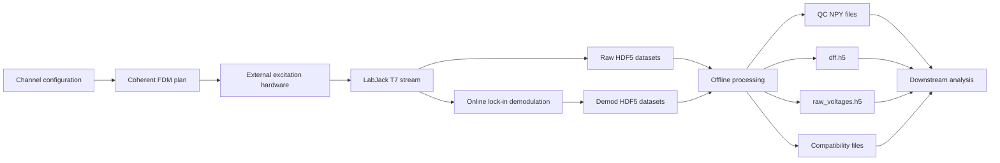

# Fiber Photometry Recording and Processing

This documentation covers the two projects in this workspace:

| Project | Purpose | Entry point |
| --- | --- | --- |
| `fiber_photometry_recording_202606` | Configure the LabJack T7 and external excitation electronics, acquire raw signals, demodulate photodiode signals online, display live plots, and save a session HDF5 file. | `python run_fp.py` |
| `fiber_photometry_processing_pipeline_202605` | Validate and trim a recorded session, downsample signals, calculate reference-corrected dF/F, and create files expected by downstream analysis code. | `python run_process.py` |

## System at a glance



## Recommended reading order

1. [End-to-End Workflow](workflow.md) explains how a session moves from configuration to analysis-ready files.
2. [Online Recording](recording.md) documents hardware setup, GUI operation, threads, demodulation, and recording behavior.
3. [Processing Pipeline](processing.md) documents offline QC, resampling, dF/F calculation, and compatibility exports.
4. [Data Formats](data-formats.md) is the authoritative reference for HDF5, NPY, JSON, and MAT outputs.
5. [API Reference](api-reference.md) describes every class and function in both projects.
6. [Operations and Troubleshooting](operations.md) provides checklists and common failure diagnoses.

## Important assumptions

- Python 3.11 is the documented runtime for both projects.
- The recording project is configured for frequency-division multiplexing (FDM).
- `IE` is treated as the reference excitation during offline processing.
- The current processing entry point saves `dff_results[('F1', 'E1')]['zn']` as the single trace in `dff.h5`.
- A processing session directory must contain exactly one file matching `*_fiber_photometry.h5`.
- The recorder and processor use friendly channel names such as `TrialStart`, `Opto`, `F1`, and `E1`; metadata maps those names to physical LabJack channels.

## Building this documentation

Install MkDocs and preview locally:

```powershell
pip install mkdocs
mkdocs serve
```

Build the static site:

```powershell
mkdocs build
```

The generated site is written to `site/`. GitHub Pages can publish it with `mkdocs gh-deploy` or a repository Pages workflow.

