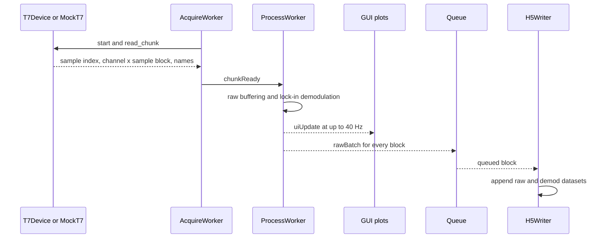

# End-to-End Workflow

## 1. Prepare the recording computer

Create the recording environment:

```powershell
conda create -n fiber-photometry python=3.11 -y
conda activate fiber-photometry
pip install numpy h5py PyQt6 pyqtgraph labjack-ljm
```

For real hardware, install the LabJack LJM driver separately. Without LJM, the GUI automatically uses `MockT7` and can generate synthetic data or play a legacy CSV file.

## 2. Configure channels

Run the recorder:

```powershell
cd fiber_photometry_recording_202606
python run_fp.py
```

The default channel configuration is:

| Logical name | Role | Physical input | Default frequency |
| --- | --- | --- | --- |
| `IE` | Reference excitation | `AIN0` monitor | 811 Hz |
| `E1` | Signal excitation | `AIN1` monitor | 1307 Hz |
| `E2` | Signal excitation | `AIN2` monitor | 2111 Hz |
| `F1` | Photodiode | `AIN3` | N/A |
| `F2` | Photodiode | `AIN4` | N/A |
| `TrialStart` | Digital input | `MIO0` | N/A |
| `Opto` | Digital input | `MIO1` | N/A |

Edit enable state, frequency, Vpp, Vbias, AIN, DAC, and DIO values in the Config tab. The names and roles are read-only because other parts of the workflow use them as semantic identifiers.

## 3. Build the coherent acquisition plan

Click **Build Plan**. The application:

1. Adds the default AD9833, MCP4728, and shift-register bindings for `IE`, `E1`, and `E2`.
2. Collects enabled analog and digital scan channels.
3. Limits the per-channel sample rate to `100000 / channel_count` Hz.
4. Chooses a block length `L` from a fixed candidate set.
5. Rounds every excitation frequency to an integer Fourier bin `k` so each block contains a coherent number of cycles.
6. Creates one waveform and one `ExcitationPlan` per enabled excitation.
7. Applies the plan to either `T7Device` or `MockT7`.

Coherent frequencies reduce spectral leakage in online lock-in demodulation. The displayed adjusted frequencies may therefore differ slightly from the requested frequencies.

## 4. Program and verify real hardware

In real-T7 mode, `T7Device.apply_plan()`:

- writes AD9833 frequency words over SPI,
- writes MCP4728 bias voltages over I2C,
- writes six-bit Vpp codes through the parallel shift-register lines,
- resolves LabJack stream addresses for all selected inputs.

The Vpp code-to-voltage relation is measured into `vpp_lut.json`. If a valid LUT exists for all enabled excitation names, it is loaded. Otherwise, the GUI starts an interactive 64-code sweep. After the LUT is available, target Vpp values are converted to their nearest measured code and Vbias is iteratively trimmed.

Use **Verify LUT** to capture monitor waveforms and compare measured frequency, Vpp, and Vbias against the plan. The GUI uses these tolerances:

| Quantity | Tolerance |
| --- | --- |
| Frequency | 0.5% |
| Vpp | 5% |
| Vbias | 25 mV |

## 5. Calibrate without saving

The Calibration tab starts the same acquisition and processing threads as a session, but does not create an HDF5 writer. Use it to inspect excitation monitors, raw photodiode signals, digital inputs, and online demodulated amplitudes.

## 6. Record a session

In the Session tab:

1. Select a base directory.
2. Select or add a subject.
3. Choose subject-folder or base-folder storage.
4. Click **Start Session**.

The active filename is always:

```text
SUBJECT_YYYYMMDD_fiber_photometry.h5
```

The visible Log name field does not currently change the filename. If subject-folder storage is selected, the file is written below `BASE_DIR/SUBJECT/`; otherwise it is written directly below `BASE_DIR/`.

During recording:



The processing worker uses two cascaded low-pass lock-in stages, optional DC removal, optional common-mode removal, and demodulation decimation. The GUI currently starts it with 8 ms for both filter stages, 600 Hz demodulation target, 5 s baseline constant, 2 s DC constant, and common-mode removal disabled.

## 7. Stop and inspect the recording

Click **Stop** before closing the application. The application stops the device, closes both Qt threads, sends a sentinel to the writer queue, flushes metadata, and closes the HDF5 file.

Confirm that the file contains non-empty `/raw/time` and `/demod/time` datasets. Also inspect `/meta` attribute `dropped_chunks_detected` and `/events/drop_log`.

## 8. Process the session

Create the processing environment:

```powershell
conda create -n fiber-photometry-process python=3.11 -y
conda activate fiber-photometry-process
pip install numpy matplotlib h5py scipy scikit-learn tifffile tqdm cellpose
```

Edit `list_sess_path` in `run_process.py` so it contains the session directories, then run:

```powershell
cd fiber_photometry_processing_pipeline_202605
python run_process.py
```

For every session, the pipeline:

1. finds exactly one recording HDF5 file,
2. trims 0.25 s from both raw recording edges,
3. reports malformed `TrialStart` and `Opto` pulses,
4. trims demodulated data to the same time interval,
5. downsamples demodulated signals to approximately 500 Hz,
6. samples digital channels at the nearest raw timestamp,
7. writes QC NPY arrays,
8. removes the `IE` reference with robust Huber regression,
9. estimates a rolling 10th-percentile baseline over 60 s,
10. computes dF/F and median-absolute-deviation z-scores,
11. saves the `F1/E1` robust z-score to `dff.h5`,
12. creates compatibility `ops.npy`, `masks.h5`, and `raw_voltages.h5`,
13. renames one behavioral MAT file to `bpod_session_data.mat` when possible.

## 9. Hand off to analysis

The downstream analysis-facing files are `dff.h5`, `raw_voltages.h5`, `masks.h5`, `suite2p/plane0/ops.npy`, and `bpod_session_data.mat`. The `qc_results` directory preserves the processed timebase, digital traces, and every demodulated photodiode/excitation pair for inspection or alternate analysis.

